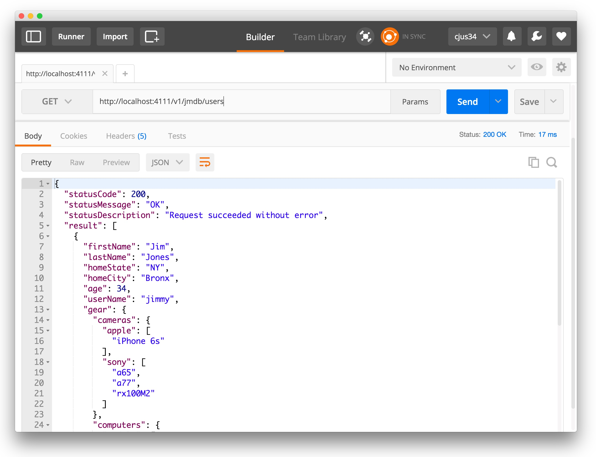

## A JSON Memory Database with a RESTFul API
JMdb is a JSON [datastore](https://en.wikipedia.org/wiki/Data_store) microservice. It is built as a [`Hydra`](https://www.npmjs.com/package/hydra) based microservice.
JMdb is also available as a [Docker container](https://hub.docker.com/r/cjus/jmdb/tags).

## Introduction

You can think of JMdb as an interface to a database with an HTTP front-end. This approach was popularized by CouchDB in early 2005 and is still in use today in [Apache CouchDB](http://couchdb.apache.org/) and the commercial [CouchBase](http://www.couchbase.com) products.

The result is that database operations become familiar HTTP requests and working with JSON retains its native feel. Gone are database adapters and database programming.

This abstraction allows services to focus on core functionality without the additional and often unnecessary burdens involved. As such, JMdb is intended to help speed the development of services which require a database to store information.

## Warning

JMdb is NOT a replacement for even the weakest of databases! You have been warned. The reason is that JMdb lacks data integrity features which help prevent data loss in those less-than-happy-path scenarios.

Here are just some of the downsides:

* Operations are not atomic
  * Two processes can update data underneath the other
* Query capabilities are limited

That said, JMdb is useful in the following scenarios:

* When prototyping
* With small (less demanding) microservices
* As an alternative caching server
* Or for applications which would have written to disk anyway

## Data storage model

The JMdb store consists of a single database which is organized into categories called `collections`. A collection is a named category such as `users`, `purchases`, `friends` etc... Each container consists of JSON data called documents. So a `users` collection might have hundreds of JSON documents. A document consists of JSON fields and values. In this regard, JMdb is inspired by [MongoDB](https://www.mongodb.com/).

Collections are stored as `.json` text files with arrays of documents.

## API endpoints

JMdb exposes API endpoints for use by other services and applications.  Each operation that JMdb supports can be accessed via an HTTP verb (such as GET, POST, PUT, DELETE).

HTTP Verb | Usage
--- | ---
GET | Used to *retrieve* a full JSON document or a sub-portion (branch).  Also used to *query* portions of the document
POST | Used to *add* a new JSON document
PUT | Used to *update* a JSON document or portion thereof
DELETE | Used to *remove* a document or document branch

### Connecting with JMdb

You can connect with JMdb using your web browser. HTTP GET operations can be issued from the browser search field, and other HTTP operations can be performed using your browsers dev tools.

You can also use the free [Postman application](https://www.getpostman.com/)



In your code, you can use your favorite request library or fetch in the web browser.

```javascript
let newUser = {
  "firstName": "Jim",
  "homeCity": "Bronx",
  "age": 34,
  "userName": "jimmy",
  "homeState": "NY",
  "lastName": "Jones"
};

fetch('http://localhost:4111/v1/jmdb/user', {
  method: 'post',
  body: JSON.stringify(newUser)
}).then(function(response) {
  return response.json();
}).then(function(data) {
  console.log('Document stored');
});
```

The remainder of this document will use the command-line `curl` utility.

### Adding documents

We can use the HTTP POST method to add a new 	document.

JMdb exposes endpoints with `/v1/jmdb/` prefix. This signifies that we're accessing the version 1 API for JMdb. The prefix is then appended with the name of the collection we're interested in working with. It's ok if the collection doesn't currently exist - it will be created if necessary.  The body of our POST call will contain a JSON document.  The document must be an object with one or more fields inside.

```shell
## Add user Jim
curl -X "POST" "http://localhost:4111/v1/jmdb/users" \
     -H "content-type: application/json" \
     -d $'{
  "firstName": "Jim",
  "homeCity": "Bronx",
  "age": 34,
  "userName": "jimmy",
  "homeState": "NY",
  "lastName": "Jones"
}'
```

The return value will be:

```javascript
{
  "statusCode": 201,
  "statusMessage": "Created",
  "statusDescription": "Resource created",
  "result": {
    "_id": "591b496c6b681d6aee880815"
  }
}
```

Note that the statusCode returned is 201 or HTTP 201 Created. This indicates success. The result will contain an `_id` field which represents the document ID. You'll need to provide the document ID when performing an update or delete operation on container documents. Don't worry about having to keep track of those document IDs - you get back document ID for every document created or returned from a query.

### Updating documents

To update a document we'll use the HTTP PUT method.  Note that we're providing a partial document which will be embedded in the document specified by the document ID (`_id`). Notice that the document ID matches the value we received when we create (stored) the original document.

> request format: http://localhost:4111/v1/jmdb/users?_id=591b496c6b681d6aee880815

```shell
## Update user Jim
curl -X "PUT" "http://localhost:4111/v1/jmdb/users?_id=591b496c6b681d6aee880815" \
     -H "content-type: application/json" \
     -d $'{
  "music": {
    "favorites": {
      "artists": [
        "Armin Van Buuren",
        "Paul Oakenfold",
        "Led Zeppelin",
        "New Order",
        "Spanish Harlem Orchestra"
      ],
      "styles": [
        "Techno",
        "Rock",
        "Latin"
      ]
    }
  }
}'
```

### Retrieving documents

A single document can be retrieved from JMdb by specifying the catalog name and the document ID.

> request format: http://localhost:4111/v1/jmdb/users?_id=5a26d92e190c9462fc3f069

```shell
## Get specific user
curl "http://localhost:4111/v1/jmdb/users?_id=5a26d92e190c9462fc3f069"
```

JMdb supports queries which allow you to retrieve a subset of data.

```shell
curl http://localhost:4111/v1/jmdb/users?q={.age > 13 and .age < 60}
```

The response would contain an array of documents objects. Each document object contains a document `_id`, which you can later use to update or delete a specific document.

```javascript
{
  "statusCode": 200,
  "statusMessage": "OK",
  "statusDescription": "Request succeeded without error",
  "result": [
    {
      "firstName": "Jim",
      "lastName": "Jones",
      "homeState": "NY",
      "homeCity": "Bronx",
      "age": 34,
      "userName": "jimmy",
      "gear": {
        "cameras": {
          "apple": [
            "iPhone 6s"
          ],
          "sony": [
            "a65",
            "a77",
            "rx100M2"
          ]
        },
        "computers": {
          "models": [
            {
              "name": "vic20",
              "year": 1981
            },
            {
              "name": "trs-80",
              "year": 1983
            },
            {
              "name": "macbook",
              "year": 2014
            },
            {
              "name": "macbook",
              "year": 2016
            }
          ]
        }
      },
      "_id": "5a26d651190c9462fc3f0690"
    },
    {
      "firstName": "Karla",
      "lastName": "Albert",
      "userName": "lottie",
      "homeState": "Nevada",
      "homeCity": "Vegas",
      "age": 28,
      "gear": {
        "cameras": {
          "apple": [
            "iPhone 5s"
          ]
        },
        "computers": {
          "models": [
            {
              "name": "mac",
              "year": 2005
            }
          ]
        }
      },
      "_id": "5a26d656190c9462fc3f0691"
    },
    {
      "firstName": "Kaitlyn",
      "lastName": "Williams",
      "userName": "katy",
      "homeState": "Utah",
      "homeCity": "Bountiful",
      "age": 20,
      "gear": {
        "cameras": {
          "apple": [
            "iPhone 5s"
          ]
        },
        "computers": {
          "models": [
            {
              "name": "pc",
              "year": 2016
            }
          ]
        }
      },
      "_id": "5a26d659190c9462fc3f0692"
    }
  ]
}
```

This query retrieves a list of users who have computers created after 2010.

```shell
curl http://localhost:4111/v1/jmdb/users?q={.gear.computers.models.year > 2010}
```

And this one queries users by favorite artists:

```shell
curl "http://localhost:4111/v1/jmdb/users?q=.music.favorites.artists"
```

JMdb uses `jspath` as its query engine. See additional query examples at: https://github.com/dfilatov/jspath


### Retrieving collections

You can retrieve entire collections by catalog name. For very large collections this isn't advisable - but still possible. Instead, use query operations to retrieve a subset of data.

> request format: http://localhost:4111/v1/jmdb/users

```shell
## Get all users
curl "http://localhost:4111/v1/jmdb/users"
```

### Deleting documents

> request format: http://localhost:4111/v1/jmdb/users?_id=591b496c6b681d6aee880815

```shell
## Delete single user
curl -X "DELETE" "http://localhost:4111/v1/jmdb/users?_id=591b496c6b681d6aee880815"
```

### Deleting collections

> request format: http://localhost:4111/v1/jmdb/users

```shell
## Delete users catalog
curl -X "DELETE" "http://localhost:4111/v1/jmdb/users"
```

## Backing up data

JMdb stores collections as single files containing JSON data. For example, a user collection would exist on disk as `user.json`. As such, data backups are simply file copies.